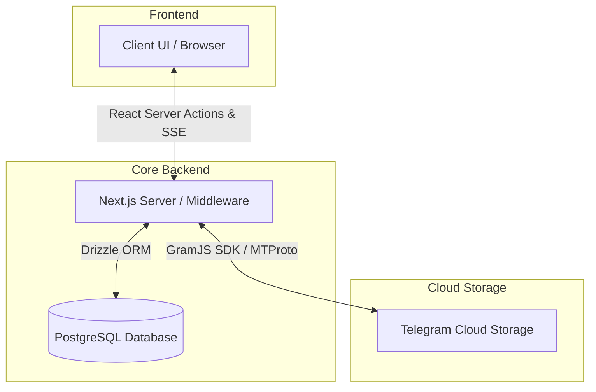
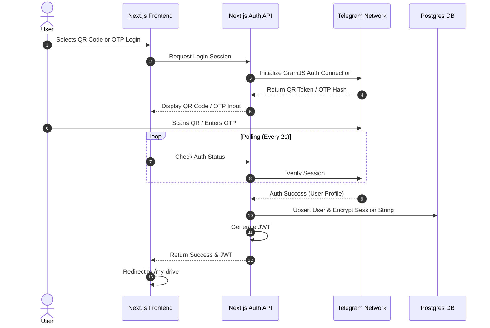
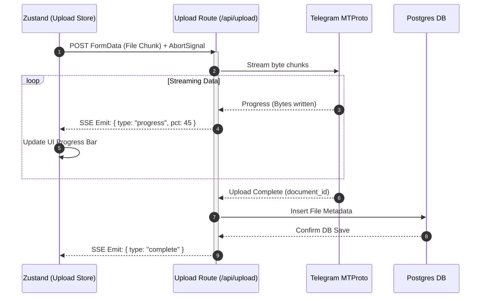
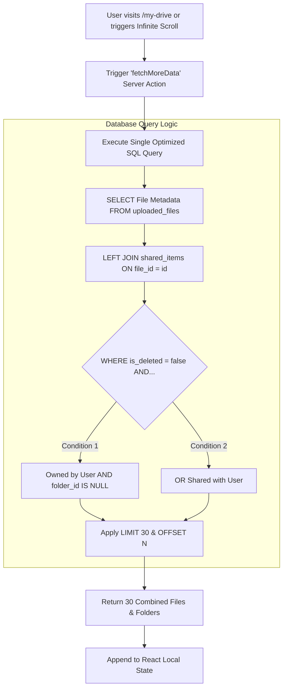

# Architecture & Feature Details

This document provides an in-depth overview of the architecture and comprehensive feature set of the Cloud Storage Platform backed by the Telegram MTProto network.

## 1. Architectural Overview

The application is built on a highly optimized 3-tier architecture:

- **Frontend (Client):** Built with Next.js (React 19), Tailwind CSS, shadcn/ui, and Zustand for global state management. It features a fully responsive design, ensuring seamless usage across desktop, tablet, and mobile devices.
- **Backend (Middleware):** Next.js Server Components and Server Actions handle API requests, streaming, and database mutations securely.
- **Database & Storage:** PostgreSQL (via Drizzle ORM) is used purely for lightweight metadata (names, IDs, aliases, permissions). The actual binary file data is streamed directly to Telegram's MTProto servers (via GramJS), providing limitless cloud storage.

## 2. Comprehensive Feature Set

### A. Authentication & Security

- **Telegram Login (Passwordless):** Users log in using their Telegram accounts. The platform supports dynamic QR Code scanning or Phone Number/OTP verification.
- **2FA Support:** Fully supports Telegram accounts with Two-Factor Authentication enabled.
- **Secure Session Management:** Telegram session strings are AES-encrypted before being stored in the database. JWTs are used for stateless client-side route protection.

### B. File & Folder Management (CRUD)

- **One-Level Hierarchy:** To maintain a clean and structured workspace, the application enforces a one-level folder hierarchy. Top-level folders can contain files, but nested folders (folders inside folders) are intentionally restricted.
- **Upload (Real-Time SSE):** Files are uploaded via Server-Sent Events (SSE). A floating widget tracks real-time progress, groups files by folder, and allows background processing and upload cancellation (via `AbortController`).
- **File Operations:** Standard CRUD operations are fully supported. Users can rename files/folders, download files, and move files into specific folders.

### C. Trash & Permanent Deletion

- **Soft Delete (Trash):** Deleted items are moved to a dedicated "Trash" view (`isDeleted` flag in the database), preventing accidental data loss.
- **Permanent Delete:** Users can permanently destroy files from the Trash, which cleans up the database records.

### D. Sharing & Access Management

- **Share Files & Folders:** Users can share individual files or entire folders with other registered users on the platform.
- **Role-Based Access Control (RBAC):** Granular access management allows assigning roles such as `Viewer`, `Editor`, or `Owner`.
- **Shared With Me Page:** A dedicated view for users to see all files and folders shared with them by others.
- **Secure Links:** Users can generate and copy secure, encrypted links to share items directly.

### E. Tracking & Recent Logs

- **Audit Trail:** The system tracks user interactions (Uploads, Edits, Shares, and Downloads).
- **Recent Activity Page:** A timeline view showing recently touched files, acting as a workflow hub to quickly resume tasks without navigating the entire drive.

### F. Discovery & Smart Features

- **Smart Search:** A powerful search bar allows users to instantly find files and folders by name across their drive.
- **AI Chat (Dummy):** An integrated AI chat interface ("Ask AI" feature) designed to assist users with summarizing documents or finding information (currently in a dummy/placeholder state for future LLM integration).
- **Bookmarks:** Users can "Star" or bookmark important files and folders.
- **Bookmarked Items Page:** A separate, dedicated tab to quickly access all bookmarked/starred items.

### G. UI / UX Enhancements

- **Theming:** Full support for Light and Dark modes.
- **Responsiveness:** The layout adapts intelligently to mobile screens (using `DataTable` or mobile-friendly file tiles) and desktop screens (using grid/list toggle views).

 
 

# ==========================================

# FILE 2: application-flow.md

# ==========================================

# Application Flow & Diagrams

This document visualizes the core mechanics and data flows of the Cloud Storage Platform using Mermaid diagrams.

## 1. High-Level System Architecture

## 2. Authentication Flow (QR Code & OTP)

## 3. Real-Time Upload Engine (SSE Pipeline)

## 4. Dashboard Data Retrieval & Pagination

