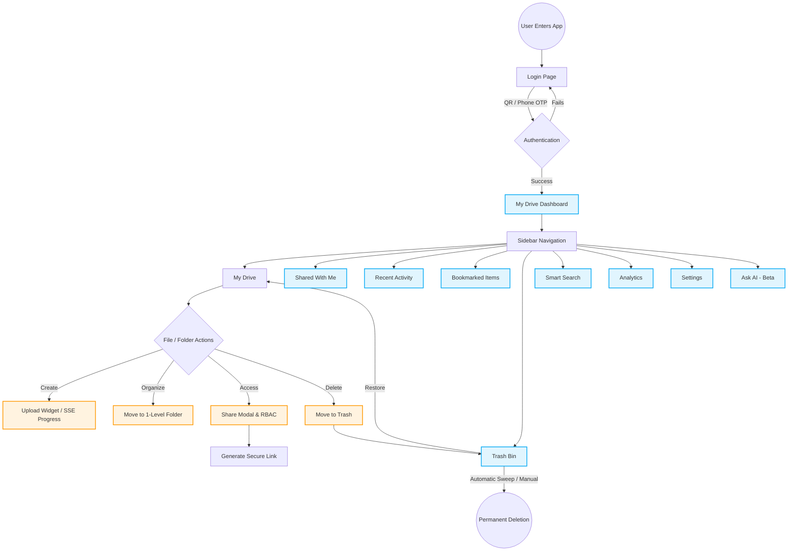
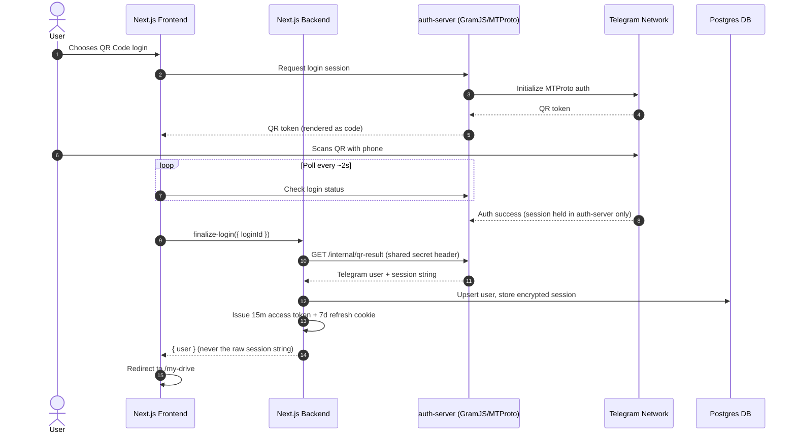
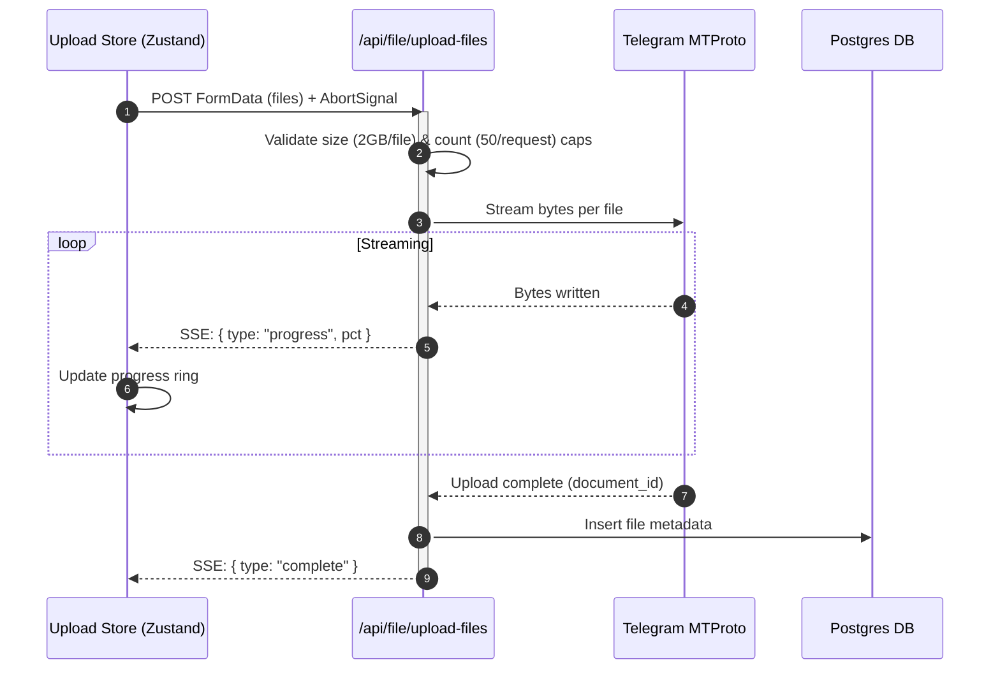
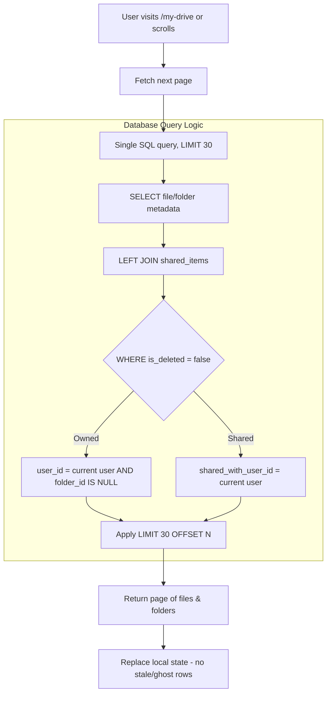

# End-to-End User Journey & Application Flow

This document details the complete flow of the application from the perspective of an end-user. It explains how a user enters the platform, navigates the interface, and utilizes the various features to manage and share their cloud storage.

---

## 1. Phase 1: Onboarding & Authentication

The user journey begins at the login screen. Since the application relies on Telegram's infrastructure for storage, traditional email/password registration is bypassed entirely — a Telegram account **is** the account.

1. **Arrival:** The user lands on the login page and chooses one of two sign-in methods.
2. **QR Code Login:**
   - The frontend requests a login session from a dedicated **auth-server** (a standalone Node/Express service that speaks Telegram's MTProto protocol via GramJS).
   - The auth-server generates a QR token and the frontend renders it as a scannable code, polling for status every couple of seconds.
   - The user opens Telegram on their phone (Settings → Devices → Link Desktop Device) and scans the code.
   - Once Telegram confirms the scan, the raw session data is held **only** inside the auth-server process — it never touches the browser. The Next.js backend fetches it through a private, secret-guarded server-to-server call (`/internal/qr-result`), and only ever hands the browser a minimal `{ status, firstName }` payload.
3. **Phone Number (OTP) Login:**
   - The user enters their phone number; Telegram sends a verification code to their Telegram app (not SMS), which the user types into the web form.
4. **2FA Verification (if applicable):** If the user's Telegram account has Two-Step Verification enabled, they're prompted for their cloud password before the session can be finalized.
5. **Rate Limiting:** Login, OTP, and QR-start requests are all throttled by a sliding-window rate limiter to blunt brute-force/spam attempts against a real phone number or account.
6. **Session Issuance:** On success, the server mints a short-lived **access token** (15 minutes, kept only in memory on the client — never written to `localStorage`) and a longer-lived **refresh token** (7 days, stored in an httpOnly cookie the client-side JS can't read). The user is redirected to `/my-drive`.

---

## 2. Phase 2: Dashboard Orientation (My Drive)

Once logged in, the user is presented with their main workspace, "My Drive".

1. **UI Customization:** The user can toggle between a visual **Grid View** (thumbnails) and a compact **List View** (virtualized data table for large lists), and switch between **Light and Dark** theme.
2. **Responsive Adaptation:** The layout adapts across desktop, tablet, and mobile — on small screens, tables collapse into touch-friendly file tiles.
3. **Workspace View:** A clean, one-level hierarchy: top-level folders first, then standalone root files.

---

## 3. Phase 3: Core Operations (Upload & Manage)

1. **Uploading Data:**
   - The user drags a file/folder into the browser window or clicks "New".
   - A **floating upload widget** shows real-time per-file progress over Server-Sent Events (SSE).
   - **Limits:** each request is capped at 50 files and 2GB per file, to keep uploads reliable and prevent runaway memory usage on the server.
   - **Multitasking:** the widget can be minimized while the user keeps navigating; uploads can also be cancelled mid-flight.
2. **Structuring Data (One-Level Hierarchy):**
   - The user creates a folder via "New Folder". Files can be moved into it, but folders cannot be nested inside other folders — this is enforced structurally in the database schema, not just in the UI, so it can never be bypassed by a stray API call.
3. **File Interactions (CRUD):** From the `...` menu on any file/folder: **Rename** (255-character limit, validated for both files and folders), **Move** (validated against the destination folder actually existing and being owned by the user), **Download**, **Bookmark**.

---

## 4. Phase 4: Collaboration & Sharing

1. **Initiating Share:** "Share" from a file/folder's action menu opens the Share dialog.
2. **Smart Search & Invite:** The user searches by name to find another registered user to invite.
3. **Role-Based Access Control:** Two roles are actually assignable:
   - **Viewer:** can see and download only.
   - **Editor:** can additionally rename, move, or modify the item.
   - **Owner** is shown in the role list but is reserved and disabled — it always belongs to whoever originally uploaded the item, and can't be reassigned.
4. **Link Generation:** "Copy Link" produces a share URL whose token is opaque and server-verified — the recipient never sees the underlying file/folder ID.
5. **Shared With Me:** The invited user sees the item under **Shared With Me** in their own sidebar, respecting whatever role they were granted.
6. **Access changes and revocation** are scoped to the sharing owner only — no other user, including a shared Editor, can alter or revoke someone else's access to the same item.

---

## 5. Phase 5: Productivity & Discovery

1. **Top Search Bar:** instant, debounced name search across the user's entire drive.
2. **Smart Search Page:** a dedicated `/smart-search` page with a "Smart" mode toggle intended for natural-language style queries (e.g. "PDFs in Engineering"), alongside standard results.
3. **Bookmarks:** starred files/folders, collected on their own **Bookmark** page.
4. **Recent Activity:** a chronological timeline of the user's own actions (uploads, edits, shares) grouped into Today / Yesterday / Earlier this week / Older, with quick "Open" / "Show in folder" actions.
5. **Analytics:** a dedicated `/analytics` page (charts via Recharts) showing storage breakdown by file type, upload activity over the last 90 days, top contributors, and folder-level insights.
6. **AI Chat (Beta):** a chat-style interface for asking questions across selected documents. Currently a UI-complete placeholder ahead of a live LLM integration — no real inference happens yet.
7. **Settings:** workspace-level preferences (default view, organization display name, layout preferences).

---

## 6. Phase 6: Data Lifecycle (Trash & Deletion)

1. **Soft Deletion:** deleting a file/folder marks it `isDeleted` rather than destroying it — it disappears from "My Drive" but isn't gone.
2. **Trash Bin:** the **Trash** page lists everything currently soft-deleted, showing time remaining before automatic permanent deletion.
3. **Manual Actions:** **Restore** returns an item to its original location; **Delete Permanently** destroys it immediately.
4. **Automatic Sweep:** a scheduled cron job periodically finds trash past its retention window and permanently deletes it. To avoid ever orphaning a database record, the sweep first resolves what *would* be deleted (dry run), deletes the underlying Telegram message, and only then commits the database delete — and one user's failure can't abort the sweep for everyone else.

---

## Visualizing the User Journey (Diagrams)

### Diagram 1: The Complete User Navigation Flow

### Diagram 2: Authentication Flow (QR Code, Server-to-Server Handoff)

### Diagram 3: Real-Time Upload Engine (SSE Pipeline)

### Diagram 4: Dashboard Data Retrieval & Pagination

