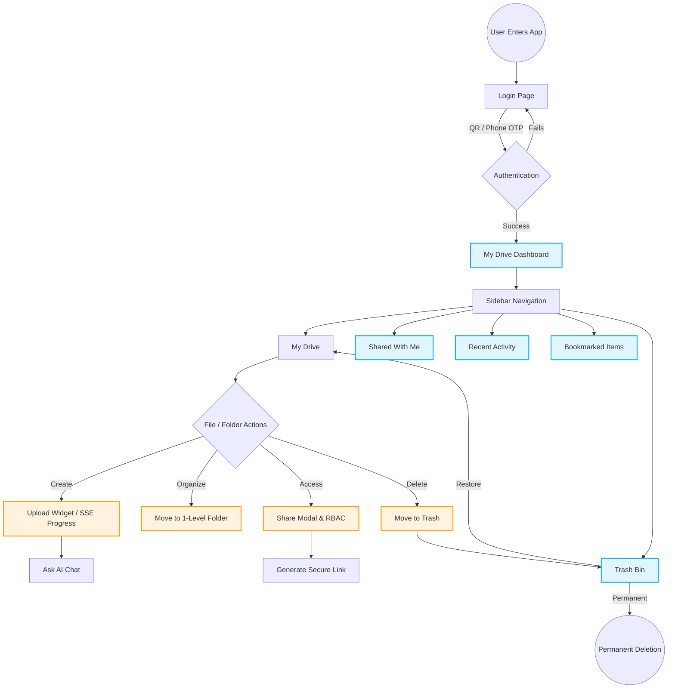

# End-to-End User Journey & Application Flow

This document details the complete flow of the application from the perspective of an end-user. It explains how a user enters the platform, navigates the interface, and utilizes the various features to manage and share their cloud storage.

---

## 1. Phase 1: Onboarding & Authentication

The user journey begins at the login screen. Since the application relies on Telegram's infrastructure for storage, traditional email/password registration is bypassed entirely.

1. **Arrival:** The user lands on the application's login page.
2. **Login Selection:** The user chooses between two secure login methods:
   - **QR Code:** A dynamic QR code is generated on-screen. The user opens their Telegram mobile app (Settings > Devices > Link Desktop Device) and scans the code.
   - **Phone Number (OTP):** The user enters their phone number. A 5-digit verification code is sent directly to their Telegram app, which they enter into the web interface.
3. **2FA Verification (If applicable):** If the user has Two-Factor Authentication enabled on their Telegram account, they are prompted to enter their cloud password.
4. **Redirection:** Upon successful authentication, the system generates a secure session, and the user is automatically redirected to their primary dashboard (`/my-drive`).

---

## 2. Phase 2: Dashboard Orientation (My Drive)

Once logged in, the user is presented with their main workspace, known as "My Drive".

1. **UI Customization:** The user can tailor their experience by toggling between a visual **Grid View** (large thumbnails) or a compact **List View** (detailed tabular data). They can also switch the application theme between **Light and Dark Mode**.
2. **Responsive Adaptation:** Whether the user is on a desktop, tablet, or smartphone, the UI adjusts automatically. On mobile, data tables transform into touch-friendly file tiles.
3. **Workspace View:** The user sees a clean, one-level hierarchy. Top-level folders are displayed at the top, followed by standalone root files.

---

## 3. Phase 3: Core Operations (Upload & Manage)

The core utility of the app is managing files. The user can interact with their drive seamlessly.

1. **Uploading Data:**
   - The user drags and drops a file/folder into the browser window or clicks the "New" button.
   - A **Floating Upload Widget** appears in the bottom corner. The user sees a real-time progress ring indicating upload status (powered by SSE).
   - **Multitasking:** The user can minimize this widget and continue navigating the app, creating folders, or reading documents while the upload finishes in the background.
2. **Structuring Data (One-Level Hierarchy):**
   - The user clicks "New Folder" to create a directory.
   - To keep the workspace clean and prevent extreme nesting, the system allows files to be placed _inside_ these folders, but restricts the creation of sub-folders (folders inside folders).
3. **File Interactions (CRUD):**
   - By clicking the `...` (More Options) menu on any file or folder, the user can:
     - **Rename** the item.
     - **Move** the item into a specific folder.
     - **Download** the item to their local machine.
     - **Bookmark** the item for quick access later.

---

## 4. Phase 4: Collaboration & Sharing

The user wants to collaborate with a colleague on a specific document or folder.

1. **Initiating Share:** The user selects "Share" from the file's action menu. A Share Dialog modal opens.
2. **Smart Search & Invite:** The user types the name or `@username` of another registered user. The system uses a debounced Smart Search to quickly find the colleague.
3. **Role-Based Access Control (RBAC):** The user assigns a specific permission level:
   - **Viewer:** Can only see and download the file.
   - **Editor:** Can modify, rename, or move the file.
4. **Link Generation:** Alternatively, the user clicks "Copy Link" to generate a secure, AES-encrypted shareable URL to send via external messaging apps.
5. **Shared With Me:** When the colleague logs in, they navigate to the **Shared With Me** page via the sidebar to instantly access the files shared by the original user.

---

## 5. Phase 5: Productivity & Discovery

As the user's drive grows, they utilize advanced tools to find and track their work.

1. **Smart Search:** The user uses the top search bar to instantly query files and folders by name across their entire drive.
2. **Bookmarked Items:** The user clicks the **Bookmarks** tab in the sidebar to view a consolidated list of all the files and folders they previously starred.
3. **Recent Activity Hub:** The user navigates to the **Recent** page. Instead of a standard file list, this page shows a chronological timeline of their actions (e.g., "You uploaded X", "You edited Y").
   - From here, the user can instantly resume work using contextual actions like "Open Preview" or "Show in Folder".
4. **AI Chat (Dummy):** The user clicks the **Ask AI (Sparkle icon)** to interact with an integrated chat assistant designed to summarize documents or quickly fetch data insights.

---

## 6. Phase 6: Data Lifecycle (Trash & Deletion)

When files are no longer needed, the user manages their storage lifecycle.

1. **Soft Deletion:** The user selects multiple files and clicks "Delete". The files disappear from "My Drive".
2. **Trash Bin:** The user navigates to the **Trash** page from the sidebar. Here, they can review all deleted items.
3. **Final Action:**
   - **Restore:** If a file was deleted by mistake, the user restores it back to its original location.
   - **Permanent Delete:** The user selects "Delete Permanently" to completely destroy the file metadata and free up space.

---

## Visualizing the User Journey (Diagrams)

### Diagram 1: The Complete User Navigation Flow

This flowchart illustrates how a user moves through the application's pages and features.

